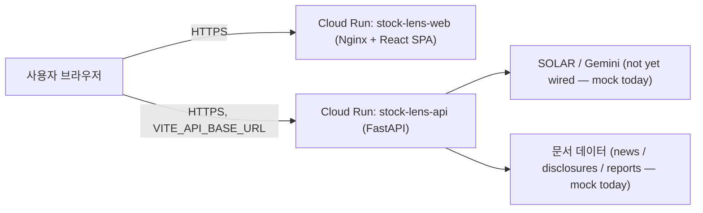
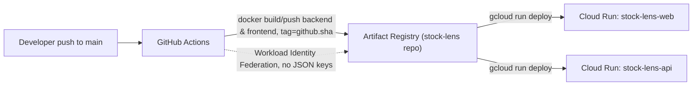
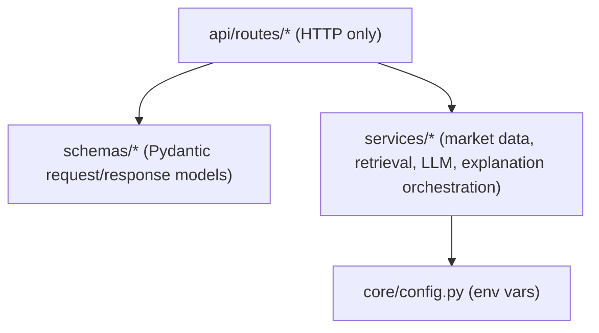

# Architecture

## Runtime request flow

Today, the "LLM" and "문서 데이터" boxes are `app/services/llm_service.py` and
`app/services/retrieval_service.py` returning hardcoded mock data — no outbound network calls
happen from the backend yet. The diagram shows the target shape once M2/M3 in
`docs/project-plan.md` land.

## Deployment pipeline

`ci.yml` runs lint/build/test/docker-build on every PR and push to `main`, but never deploys.
`deploy.yml` is the only workflow that pushes images and deploys, and only runs on push to
`main` or manual `workflow_dispatch`. See `docs/deployment.md` for what must be configured
before `deploy.yml` can succeed.

## Backend internal layering

`explanation_service.explain_movement()` is the only place that calls `market_data_service`,
`retrieval_service`, and `llm_service` together — routes never call more than one service
directly, and never contain business logic themselves.
