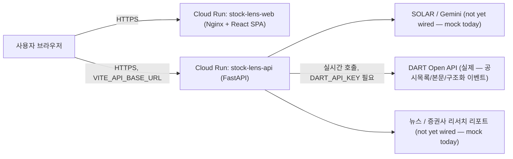
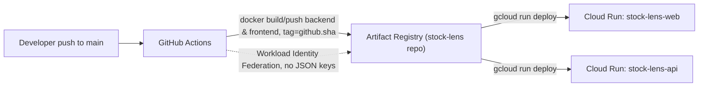
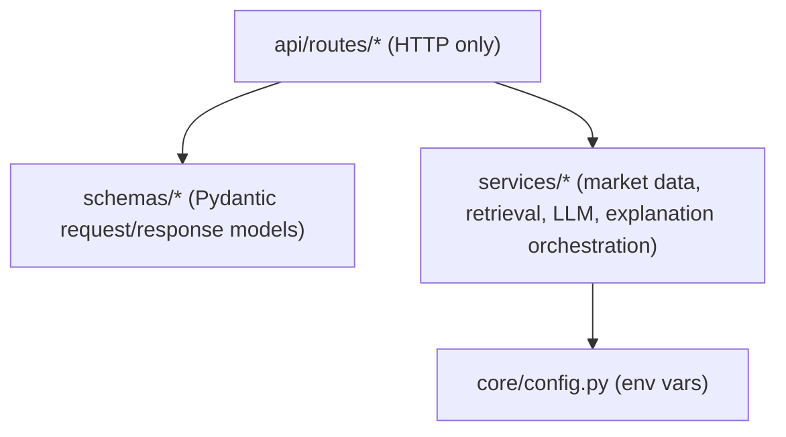

# Architecture

## Runtime request flow

`app/services/retrieval_service.py`는 이제 목업이 아니라 **실제 DART 데이터**를 쓴다: 종목별
공시 목록은 `data/step1_corpcode.py`/`step2_disclosures.py`로 미리 받아둔 스냅샷(`data/disclosures.json`,
약 3개월치, 재실행 스케줄 없음)이고, 요청이 들어올 때마다 그중 선택 날짜와 가까운 공시에 대해
DART의 `document.xml`(본문) 또는 구조화 이벤트 API(`tsstkDpDecsn`/`piicDecsn`, `data/step3_major_events.py`)를
실시간으로 호출한다. 즉 백엔드는 이제 요청 경로에서 실제로 외부(DART)로 나간다 — Cloud Run에
배포할 때 아웃바운드 네트워크와 `DART_API_KEY`(Secret Manager)가 필요하다.

반면 `app/services/llm_service.py`(요약/호재·유의 판단)와 뉴스/컨센서스는 여전히 mock/미연동이다
— llm_service는 실제 DART 공시 텍스트를 받아서 조합하지만, 그 조합·판단 로직 자체는 규칙 기반이고
실제 LLM 호출은 없다. 이 부분이 M3(및 뉴스 연동)의 남은 범위다 — `docs/project-plan.md` 참고.

## Deployment pipeline

`ci.yml` runs lint/build/test/docker-build on every PR and push to `main`, but never deploys.
`deploy.yml` is the only workflow that pushes images and deploys, and only runs on push to
`main` or manual `workflow_dispatch`. See `docs/deployment.md` for what must be configured
before `deploy.yml` can succeed.

## Backend internal layering

`explanation_service.explain_movement()` is the only place that calls `market_data_service`,
`retrieval_service`, and `llm_service` together — routes never call more than one service
directly, and never contain business logic themselves.
